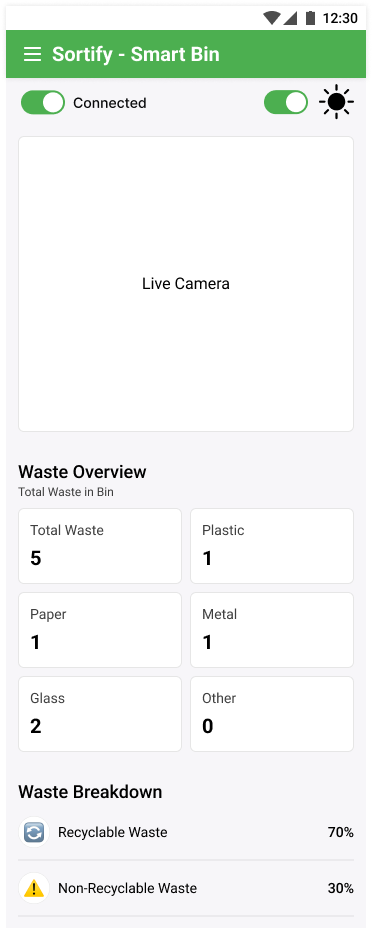
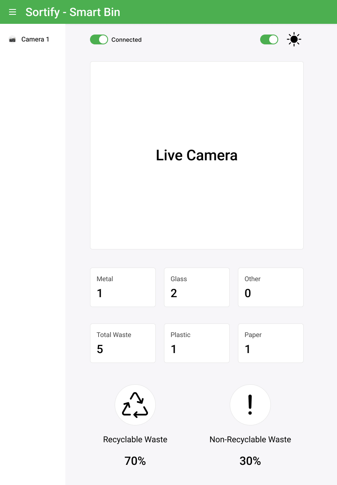
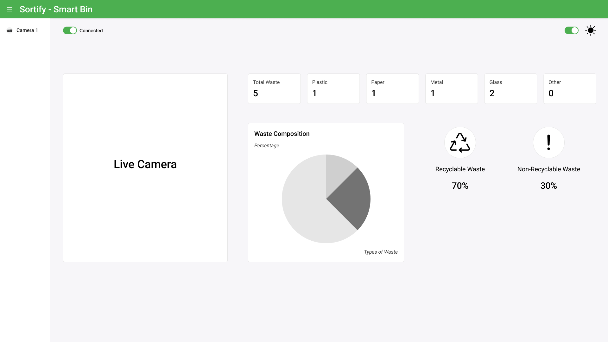
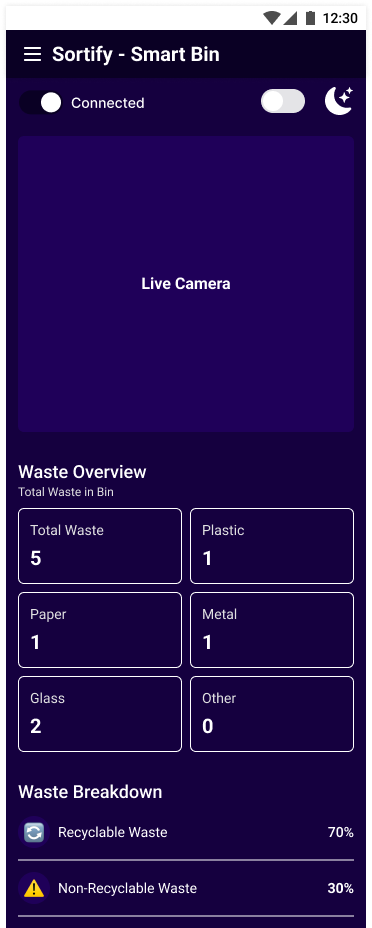
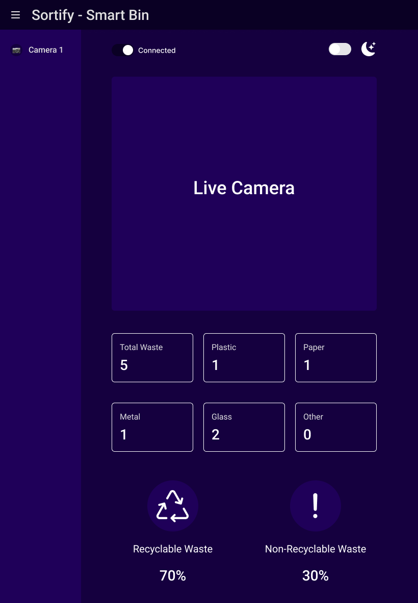
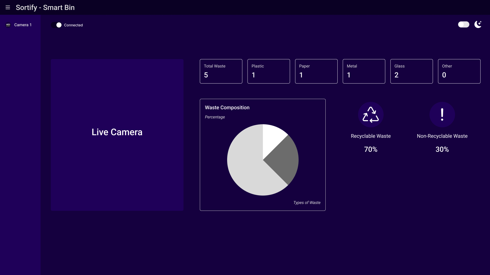

# 🌿 Sortify - Smart Trash Classification Frontend

🚀 **Sortify** adalah aplikasi berbasis web yang membantu memilah sampah secara otomatis menggunakan AI. Ini adalah repository untuk frontend aplikasi yang dibangun dengan **React + TypeScript + Vite** dan didukung oleh **Tailwind CSS** untuk tampilan yang modern dan responsif. 🌍✨

## 📥 Cara Clone & Menjalankan di Lokal

Ikuti langkah-langkah berikut untuk menjalankan proyek ini di komputer Anda.

### 🔹 1. Clone Repository

Pastikan Anda sudah menginstall **Git**. Lalu jalankan perintah berikut:

```sh
git clone https://github.com/neutrash-ai/sortify-frontend.git
cd sortify-frontend
```

---

### 🔹 2. Install Dependencies

Gunakan **npm**, **yarn**, atau **pnpm** untuk menginstall dependensi proyek.

**Dengan npm:**

```sh
npm install
```

**Atau dengan yarn:**

```sh
yarn install
```

**Atau dengan pnpm:**

```sh
pnpm install
```

---

### 🔹 3. Jalankan Development Server

Setelah semua dependensi terinstall, jalankan server pengembangan dengan:

```sh
npm run dev
```

Atau jika menggunakan **yarn**:

```sh
yarn dev
```

Atau jika menggunakan **pnpm**:

```sh
pnpm dev
```

🚀 **Server akan berjalan di `http://localhost:5173/` secara default.** Buka browser dan lihat aplikasi berjalan! 🎉

---

## 📸 Tampilan Antarmuka

Sortify dirancang dengan responsivitas penuh untuk berbagai perangkat dan mendukung mode terang dan gelap.

| Handphone                                      | Tablet                                                 | Laptop                                                 |
| ---------------------------------------------- | ------------------------------------------------------ | ------------------------------------------------------ |
|  |  |  |
|    |    |    |

---

## 🌐 Peran Frontend

Frontend Sortify berfungsi untuk:

- Menampilkan hasil **klasifikasi sampah** dari kamera ESP32 atau webcam.
- Menampilkan data statistik seperti persentase komposisi sampah dan total yang sudah diklasifikasikan.
- Mendukung **visualisasi real-time dari kamera** yang digunakan untuk klasifikasi sampah, menggunakan koneksi **Socket.IO** ke backend.

---

## 📌 Struktur Proyek

```
📦 sortify-frontend
├── 📂 public/        # File statis (favicon, manifest, screenshot UI, dll)
├── 📂 src/           # Kode utama aplikasi
│   ├── 📂 assets/    # Gambar & ikon yang diimpor langsung
│   ├── 📂 components/ # Komponen UI yang dapat digunakan kembali
│   ├── 📂 pages/     # Halaman utama aplikasi
│   ├── 📜 App.tsx    # Komponen utama aplikasi
│   ├── 📜 main.tsx   # Entry point aplikasi
│   ├── 📜 index.css  # File Tailwind CSS utama
│   ├── 📂 context/   # Variabel Global
│   ├── 📂 constant/  # Fungsi constant (ex: mendapatkan IP dinamis)
├── 📜 package.json   # Dependensi proyek
├── 📜 tailwind.config.js # Konfigurasi Tailwind CSS
├── 📜 vite.config.ts  # Konfigurasi Vite
└── 📜 .gitignore     # File & folder yang tidak di-push ke GitHub
```

---

## ❓ FAQ

❓ **Apa yang harus saya lakukan jika terjadi error saat menjalankan `npm install`?**
✅ Pastikan Anda menggunakan **Node.js versi terbaru**. Cek dengan:

```sh
node -v
```

Jika belum terinstall, unduh dari [Node.js official website](https://nodejs.org/).

❓ **Bagaimana jika port 5173 sudah digunakan?**
✅ Jalankan Vite di port lain dengan:

```sh
npm run dev -- --port=3000
```

---

## 🚀 Happy Coding!
